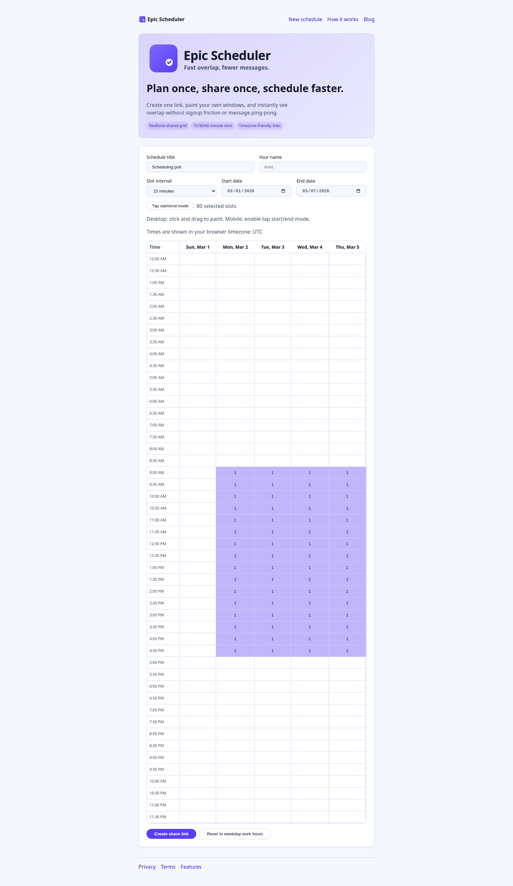
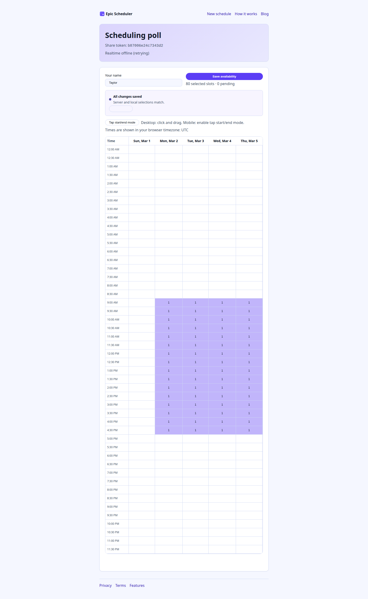
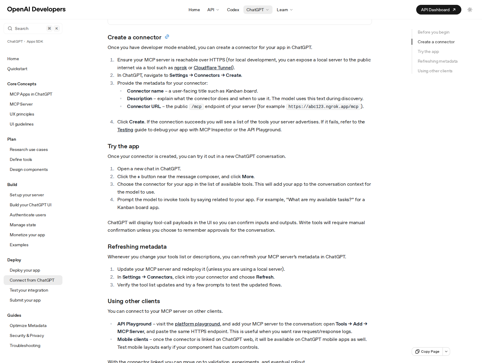
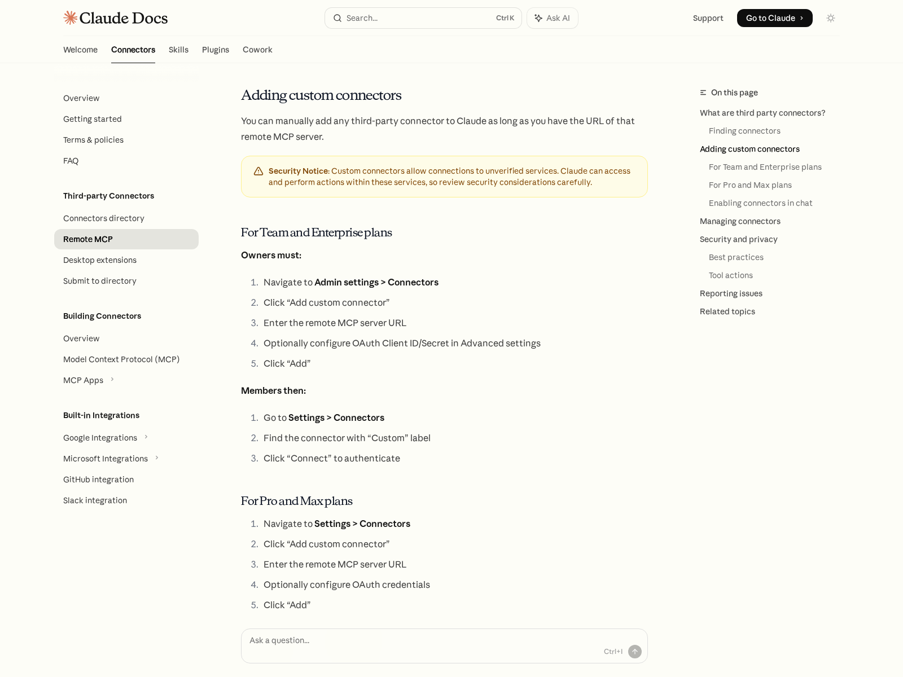
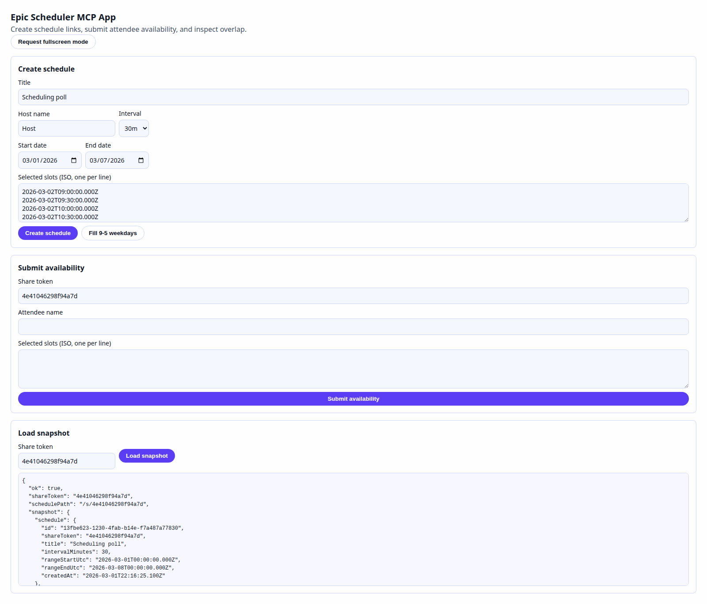

# How to use Epic Scheduler with ChatGPT and Claude via MCP

If you can paste a schedule link, an AI agent can submit your availability for
you.

This post walks through:

- How Epic Scheduler's MCP server works.
- How to add it as a connector/app in ChatGPT and Claude.
- How to use a single `/s/:shareToken` link so the agent can respond with your
  availability.

## Why this is useful

Scheduling usually breaks down into repetitive steps:

1. Someone sends a scheduling link.
2. Everyone manually opens it and paints availability.
3. People forget, or they choose impossible windows.

With MCP, you can delegate this:

- Paste the scheduling link into ChatGPT or Claude.
- Ask the model to respond as you with your constraints.
- Let the model submit your slots directly through Epic Scheduler tools.

That means less context switching and fewer "did you fill out the poll yet?"
messages.

## What Epic Scheduler exposes over MCP

Epic Scheduler serves a public MCP endpoint at:

- `https://<your-domain>/mcp`

And exposes these core tools:

- `create_schedule`
- `submit_schedule_availability`
- `get_schedule_snapshot`
- `open_schedule_ui` (MCP App widget)

The system is link-based (no required account auth in v1), so the critical
identifier is the share token in your URL:

- Schedule URL: `https://<your-domain>/s/abc123...`
- Share token: `abc123...`

## Step 1: Get a reachable MCP endpoint

You need a public HTTPS URL that points to your Epic Scheduler deployment.

### Local testing

- Run your app locally.
- Expose it with a tunnel (for example, Cloudflare Tunnel).
- Use `<public-url>/mcp` as your connector URL.

### Deployed usage

- Deploy to Cloudflare Workers.
- Use your production domain's `/mcp` endpoint.

## Step 2: Add Epic Scheduler in ChatGPT

The OpenAI "Connect from ChatGPT" docs currently describe this flow:

1. Open `Settings -> Apps & Connectors -> Advanced settings`.
2. Enable developer mode (if your plan/org allows it).
3. Go to `Settings -> Apps & Connectors` and click `Create`.
4. Enter:
   - Connector name
   - Description
   - Connector URL: `https://<your-domain>/mcp`
5. Save, then enable that connector in a new chat via the tools/connectors UI.

Notes:

- OpenAI UI labels can change ("Apps" vs "Connectors"), but the MCP URL pattern
  stays the same.
- If your tool list changes, refresh metadata from connector settings.

## Step 3: Add Epic Scheduler in Claude

The Claude docs for remote MCP connectors currently describe:

- `Settings -> Connectors -> Add custom connector` (Pro/Max), or
- `Admin settings -> Connectors` first for Team/Enterprise owners.

Then:

1. Paste `https://<your-domain>/mcp`.
2. Optionally configure OAuth credentials if your MCP server requires them.
3. Add/connect the connector.
4. Enable it in chat from the `+` menu and Connectors list.

## The key use case: "Respond to this link with my availability"

Once the connector is active, you can hand the model a schedule URL and your
constraints.

Example prompt:

`Use Epic Scheduler to respond to this scheduling link as "Jordan Lee": https://your-domain/s/b87806e24c7343d2. I'm available Tue/Thu 9:00-11:30 AM PT and Wed 1:00-3:00 PM PT. Submit my availability and then summarize the best overlap windows.`

What the agent should do:

1. Parse the share token from the link.
2. Read the schedule snapshot and available slot context.
3. Convert your timezone constraints into valid slot timestamps.
4. Call `submit_schedule_availability`.
5. Call `get_schedule_snapshot` again and summarize overlap.

This is the "single-link handoff" workflow: a human provides one URL plus
constraints, and the AI handles the rest.

## Optional: open the MCP app widget in supported hosts

Epic Scheduler also includes an MCP app UI surface via `open_schedule_ui`.

In hosts that support MCP Apps, this opens an interactive widget for:

- creating schedules,
- submitting attendee availability,
- loading snapshots.

## Practical safety notes

Because this server is public in v1, any connected AI client can potentially
invoke write-capable tools. For production, consider:

- Cloudflare Access in front of `/mcp`,
- per-client rate limiting,
- stronger auth before exposing write tools publicly.

## Troubleshooting checklist

- Connector can't connect:
  - Confirm HTTPS URL and exact `/mcp` suffix.
  - Verify your deployment is publicly reachable.
- Tools missing in ChatGPT/Claude:
  - Refresh connector/app metadata.
  - Confirm your server still lists all tools.
- Agent submits wrong times:
  - Include your timezone explicitly in prompts.
  - Ask the model to echo converted windows before submitting.

---

If you want this to feel "assistant-native," the best pattern is:

1. share one schedule link,
2. describe your constraints in natural language,
3. let the agent submit and report overlap in one pass.
